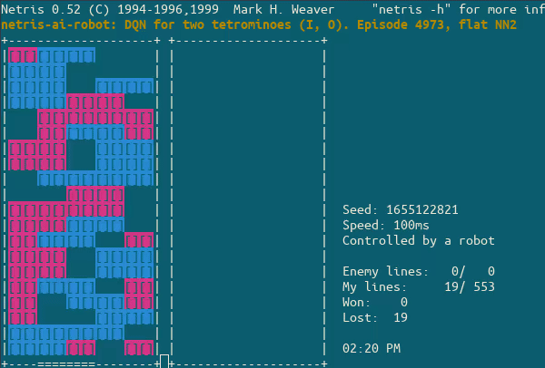

# DQN for Netris

The ultimate goal of this project is to create competitive network that can play with all seven tetrominoes, what
could be challenging [[5]](https://arxiv.org/pdf/1905.01652.pdf). Project use modified Netris (originally created by
by Mark H. Weaver) client [netris-env](https://github.com/MateuszJanda/netris) for learning.

Current status:
- Experiment 3. For single tetrimino/piece "I" model achieved target after 2000 episodes.
- Experiment 9. For two tetriminos/pieces "I" and "O" model achieved target after 4973 episodes. To accelerate learning
Netris solver was used, also more layers was used than in model from experiment 3. What is interesting client never
rotate given tetrimino.

<p align="center">

</p>

# Setup
## Project setup
Download and compile netris-env
```bash
git clone https://github.com/MateuszJanda/netris
cd netris
./Configure
make
```

Download project and prepare environment for robot
```bash
cd ~/
git clone https://github.com/MateuszJanda/netris-ai-robot.git
cd netris-ai-robot
virtualenv -p python3 venv
pip install -r requirements.txt
ln -s ~/netris/netris-env
```

## Docker setup
Create docker container
```bash
docker run -v $PWD:/tmp -w /tmp --gpus all -it --name tf_netris --network host tensorflow/tensorflow:latest-gpu
```

## DQN learning setup

### Learning setup with local (build in) environment
Use build in *etris game environment.
```bash
docker start tf_netris
docker exec -it tf_netris python experiment.py --experiment 3 --use-gpu --local-env
```
### Learning setup with Netris environment
Netris by default spawn new robot every time game end, so to overcome this we need three elements:
- game envirement/server - (Netris itself) in this case tuned version for faster learning - `netris-env`
- proxy robot (`proxy.py` ), a middleware that is run by second Netris client, and translate and pass communication
between Netris envirement and machine learning code.
- machine learning code (`experiment.py`)

1. On first terminal run Netris (environment) server
```bash
./netris-env -w -u -i 0.1
```

2. On second terminal run machine learning code

    1. With GPU support (in guest/container)
    ```bash
    docker start tf_netris
    docker exec -it tf_netris python experiment.py --experiment 3 --use-gpu --proxy-env-port 9800
    ```

    2. Alternatively, you can run DQN agent with CPU support (at host)
    ```bash
    python experiment.py --experiment 3 --proxy-env-port 9800
    ```

3. Run third and fourth (in this case `/dev/pts/3`) terminal for proxy robot and debug logging. Note that interval
(`-i`) must match value passed to Netris environment server
```bash
./netris-env -n -m -c localhost -i 0.1 -r 'python proxy.py --log-in-terminal /dev/pts/3 --port 9800'
```

# References
* [1] Volodymyr Mnih, Koray Kavukcuoglu, David Silver, Alex Graves, Ioannis Antonoglou, Daan Wierstra, Martin Riedmiller. [Playing Atari with Deep Reinforcement Learning](https://arxiv.org/pdf/1312.5602.pdf). _arXiv preprint arXiv:1312.5602, 2013_.
* [2] Volodymyr Mnih, Koray Kavukcuoglu, David Silver, Andrei A. Rusu, Joel Veness, Marc G. Bellemare, Alex Graves, Martin Riedmiller, Andreas K. Fidjeland, Georg Ostrovski, Stig Petersen, Charles Beattie, Amir Sadik, Ioannis Antonoglou, Helen King, Dharshan Kumaran, Daan Wierstra, Shane Legg & Demis Hassabis. [Human-level control through deep reinforcement learning](https://web.stanford.edu/class/psych209/Readings/MnihEtAlHassibis15NatureControlDeepRL.pdf)
* [3] Harrison Kinsley. [Training Deep Q Learning and Deep Q Networks (DQN) Intro and Agent Reinforcement Learning w/ Python Tutorial](https://pythonprogramming.net/training-deep-q-learning-dqn-reinforcement-learning-python-tutorial/)
* [4] Matt Stevens, Sabeek Pradhan. [Playing Tetris with Deep Reinforcement Learning](http://cs231n.stanford.edu/reports/2016/pdfs/121_Report.pdf)
* [5] Simón Algorta, Özgür Şimşek. [The Game of Tetris in Machine Learning](https://arxiv.org/pdf/1905.01652.pdf). _arXiv:1905.01652_
* [6] [Q-learning](https://en.wikipedia.org/wiki/Q-learning#Algorithm). _Wikipedia_
* [7] [Bellman equation](https://en.wikipedia.org/wiki/Bellman_equation). _Wikipedia_
* [8] https://www.quora.com/Artificial-Intelligence-What-is-an-intuitive-explanation-of-how-deep-Q-networks-DQN-work
