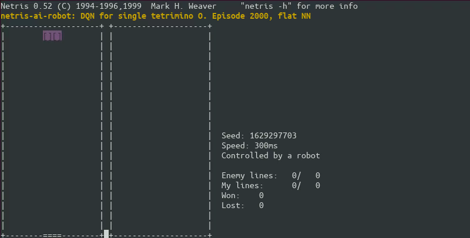

# DQN for single tetrimino/piece "O"

<p align="center">

</p>

# Setup
## Project setup
Create Python virtual environment
```bash
virtualenv -p python3 venv
pip install -r requirements.txt
```

## Docker setup
Create docker container
```bash
docker run -v $PWD:/tmp -w /tmp --gpus all -it --name tf_netris --network host tensorflow/tensorflow:latest-gpu-py3
```

## DQN learning setup
On first terminal run Netris (environment) server
```bash
./netris-env -w -u -i 0.1
```

On second terminal, run DQN agent (with GPU support at guest) in docker
```bash
docker start tf_netris
docker exec -it tf_netris python experiment.py -x 3 -g -p 9800
```

Alternatively, you can run DQN agent with CPU support (at host)
```bash
python experiment.py -x 3 -p 9800
```

On third terminal, run proxy. Note that interval (`-i`) must match value passed to Netris environment server
```bash
./netris-env -n -m -c localhost -i 0.1 -r 'python proxy.py -t /dev/pts/3 -p 9800'
```

## Example
Learned model, can be used by robot with standard Netris instance
On first terminal, run game in server mode and wait for **robot**
```bash
netris -w
```
On second terminal, connect **robot** (using supervised learning) to server as second player
```bash
netris -c localhost -r 'python robot_sup_learn.py -f'
```

# References
* [1] Volodymyr Mnih, Koray Kavukcuoglu, David Silver, Alex Graves, Ioannis Antonoglou, Daan Wierstra, Martin Riedmiller. [Playing Atari with Deep Reinforcement Learning](https://arxiv.org/pdf/1312.5602.pdf). _arXiv preprint arXiv:1312.5602, 2013_.
* [2] Volodymyr Mnih, Koray Kavukcuoglu, David Silver, Andrei A. Rusu, Joel Veness, Marc G. Bellemare, Alex Graves, Martin Riedmiller, Andreas K. Fidjeland, Georg Ostrovski, Stig Petersen, Charles Beattie, Amir Sadik, Ioannis Antonoglou, Helen King, Dharshan Kumaran, Daan Wierstra, Shane Legg & Demis Hassabis. [Human-level control through deep reinforcement learning](https://web.stanford.edu/class/psych209/Readings/MnihEtAlHassibis15NatureControlDeepRL.pdf)
* [3] Harrison Kinsley. [Training Deep Q Learning and Deep Q Networks (DQN) Intro and Agent Reinforcement Learning w/ Python Tutorial](https://pythonprogramming.net/training-deep-q-learning-dqn-reinforcement-learning-python-tutorial/)
* [4] Matt Stevens, Sabeek Pradhan. [Playing Tetris with Deep Reinforcement Learning](http://cs231n.stanford.edu/reports/2016/pdfs/121_Report.pdf)
* [5] [Q-learning](https://en.wikipedia.org/wiki/Q-learning#Algorithm). _Wikipedia_
* [6] [Bellman equation](https://en.wikipedia.org/wiki/Bellman_equation). _Wikipedia_
* [7] https://www.quora.com/Artificial-Intelligence-What-is-an-intuitive-explanation-of-how-deep-Q-networks-DQN-work
